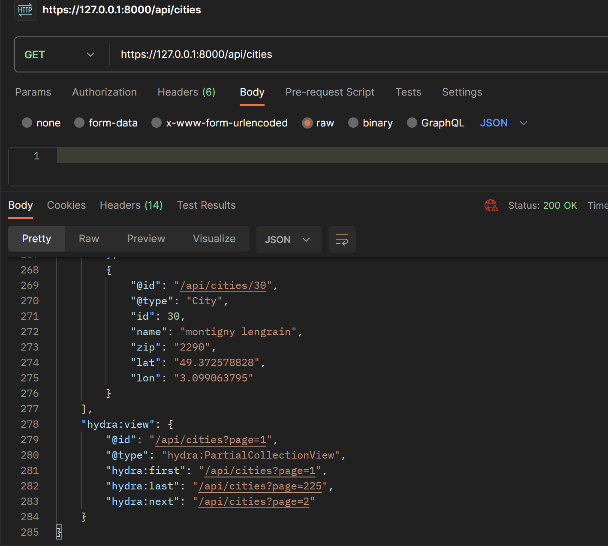

# TP création API Villes

- Creation de l'api cities avec la commande : 
```bash
symfony new cities-api
```
- On ajoutes les composants maker-bundle et orm-pack :
```bash
composer require symfony/maker-bundle --dev
```
```bash
composer require symfony/orm-pack
```
- Création d'un controller Homepage :
```bash
symfony console make:controller Homepage
```
- On ajoute le composant orm-fixtures afin de charger la base de données  :
```bash
composer require symfony/orm-fixtures
```
- Création de l'entité City :
```bash
symfony console make:entity city
- name(string,50,null yes)
- zip(string,5,null yes)
- lat(string,255,null yes)
- lon(string,255,null yes)
```
- Modification du fichier .env pour connexion a la BDD Sqlite
- Création de la BDD avec la commande :
```bash
symfony console d:d:c
```
- On fait prépare la migration :
```bash
symfony console make:migration
```
- On l'effectue avec doctrine :
```bash
symfony console d:m:m
```
- On ajoutes nos fixtures dans Datafixtures/AppFixtures, ici nous avons lu un fichier .csv 
- On charge les fixtures dans la BDD avec la commande :
```bash
symfony console d:f:l
```
- Création de l'API :
```bash
composer require api
```
- Modification de l'entité City en ajoutant des attributs  pour configurer l'api, ici :
```bash
use ApiPlatform\Metadata\Get;
use ApiPlatform\Metadata\ApiResource;
use ApiPlatform\Metadata\GetCollection;

#[ApiResource(
    operations: [
        new Get(),
        new GetCollection()
    ]
)]
```

- L'api fonctionne de cette façon : 
elle propose les endpoints suivants pour interagir avec les villes françaises :

GET /cities

Description : Récupère la liste de toutes les villes françaises.
Réponse attendue : Un tableau d'objets City.

GET /cities/{id}

Description : Récupère les détails d'une ville spécifique en fonction de son identifiant.
Paramètres : id (int) - L'identifiant de la ville.
Réponse attendue : Un objet City.

cf screenshot:



